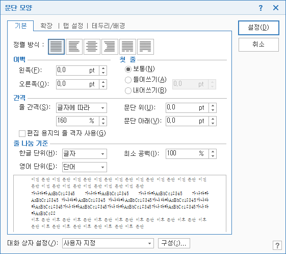
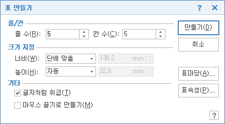
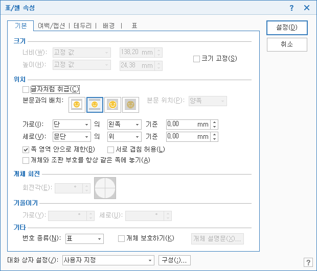

업무에 바로 쓰는 한글(기본)
========================

# Ⅰ. 간단한 문서 작성
## 1. 화면 구성
### 가. 시작 화면 설정
한글은 화면에 보이는데로 인쇄한 결과가 나타나는 프로그램입니다.

작업을 할 때도 화면에 표시되는 전체 모습을 보고 작업하는 것이 효율적입니다. 문서 작성 작업을 효율적으로 하기 위해 작업 환경을 맞추어 사용합니다.

[보기] 리본에서 [쪽 윤곽 보기]를 선택합니다. [쪽 윤곽 보기]는 편집용지 전체를 보여주는 기능으로 설정한 여백까지 모두 표시됩니다. 기본 값으로 [문단 부호]가 선택되어 있지 않는데, [문단 부호]가 표시되도록 선택합니다. 어디까지 한 문단인지, 문서 끝은 어디인지를 시각적으로 보여줍니다. [문단 부호]는 파란색 구부러진 화살표 모양으로 나타납니다.

[조판 부호]도 화면에 나타나도록 선택해야 하는 경우가 있는데, 평소에는 조판 부호를 표시하면 화면에 너무 많은 정보가 나타나서 혼란스럽고, 추가로 나타나는 조판 부호 때문에 화면 편집 모양이 흐트러져 보이는 단점이 있어 선택하지 않아야 합니다.

[그림]은 문서에 삽입된 그림을 보이도록 설정하는 항목이므로 기본값으로 선택되어 있습니다. 문서에 아주 많은 그림이 삽입되고 많은 분량의 문서를 편집하다보면 다른 쪽으로 화면을 넘길 때 아주 느리게 화면이 표시되어 정상적으로 작업하기 어려워지는 경우가 있습니다. 이런 경우 [그림]을 선택하지 않으면 그림이 들어있는 위치에 그림은 나타나지 않고 십자 모양 상자가 나타나게 되어 문서 편집 속도가 정상됩니다.

삽입한 개체의 테두리를 투명으로 선택한 경우 윤곽을 확인할 수 없는 문제가 있는데 [투명 선]을 선택하면 인쇄를 하면 보이지 않는 테두리를 문서를 편집할 때는 빨간색 점선으로 나타냅니다. 그래서 [투명 선]은 기본값으로 선택되어 있지 않지만 선택해 둡니다.

[작업 창 보이기]는 선택하지 않습니다. 화면 왼쪽이나 오른쪽에 작업창이 표시되는 것이 기본값인데 대부분 사용할 일이 없습니다.

필요에 따라 화면을 확대하거나 축소해서 그때그때 사용합니다. 요즘 사용되는 모니터는 가로 방향으로 넓은 와이드형이라 화면 확대 비율을  125% 정도로 설정해 사용할 수 있습니다. 화면을 확대/축소할 때는 메뉴나 화면 아래쪽 오른쪽에 표시되는 확대/축소 아이콘을 이용할 수도 있고 단축키 \<Ctrl + 마우스휠 위/아래>로 조절할 수도 있습니다.

### 나. 한글 기본 설정
한글 기본 설정 프로그램은 윈도 시작 단추 눌러 표시되는 시작 메뉴에서 한글과컴퓨터 폴더에 있습니다. 한글 프로그램이 실행되어 있을 때는 실행되지 않습니다.

한글을 설치한 뒤 사용하다보면 사용자의 입맛에 맞게 여러 가지 설정을 변경해 사용하게 됩니다. 이런 설정을 모두 원래대로 되돌리고 싶을 때 프로그램을 처음 설치했던 상태로 설정을 전환할 수 있습니다.

한글의 기능 선택 방식은 원래부터 제공하던 메뉴 방식과 MS 오피스 2007부터 사용되는 리본 방식 두 가지를 모두 제공합니다. 엑셀 프로그램 사용이 익숙하다면 한글 기능 선택 방식도 엑셀과 같은 모양으로 전환해 사용할 수 있습니다.

한글에서 기능을 실행할 때 가장 빠른 방법은 단축키를 이용하는 방법입니다. 그 외에 마우스 오른쪽 단추를 눌러 나타나는 빠른 메뉴에서 선택할 수도 있고, 메뉴나 리본, 도구상자에서 선택하는 방법도 있습니다. 모든 기능을 단축키로 사용하려면 단축키를 외우는 일이 오히려 더 힘든 일이 됩니다. 자주 사용하는 기능은 단축키를 이용하고, 어쩌다 한 번 쓰게 되는 기능은 다른 방법을 사용하는 것이 효율적입니다.

각 기능 단축키 확인하는 방법은 메뉴를 선택하면 기능 이름 옆에 표시되어 있고, 리본에서는 기능에 커서를 올려두고 잠시 기다리면 도움말과 함께 단축키가 있는 경우엔 표시됩니다. 도움말 \<F1>을 눌러 단축키 일람을 확인할 수도 있습니다.

## 2. 간단한 문서 작성과 한자 변환
### 가. 문서 작성
문서 작성을 할 때 내용을 입력하는 작업과 서식 작업은 나누어서 해야 합니다. 내용을 입력하는 중간 중간 서식 작업을 하게 되면 작업하는 시간이 오래 걸리게 됩니다. 내용을 모두 입력한 뒤 한꺼번에 서식 작업을 하는 것이 전체 작업 시간을 줄일 수 있는 방법입니다.

개체 삽입도 마찬가지입니다. 글상자, 표, 그림등도 내용을 모두 입력한 뒤 삽입하거나 내용 흐름을 파악하기 위해 먼저 삽입해야 한다면 서식 작업을 하지 않은 기본 상태로 삽입해 두고 내용만 작성한 뒤 나중에 서식 작업을 합니다.

입력된 내용은 글자, 단어, 문단 단위 구분합니다. 글자는 하나의 글자를 의미하고, 단어는 띄어쓰기로 구분됩니다. 문단은 \<Enter>키를 누른 것으로 인식합니다.

동해물과~로 시작하는 첫 줄의 경우 글자는 14자이고, 단어는 4개, 문단은 1개입니다. 제목까지 포함해 전체는 문단 6개입니다.

이 경우엔 글자나 단어는 앞의 경우와 같고 문단은 4개가 됩니다.

한글에서 서식 작업의 기본 단위가 글자이거나 문단을 대상으로 합니다. 그래서 어디까지가 같은 문단인지가 아주 중요합니다. 내용을 입력할 때 줄 끝부분에 도착했다고 그냥 \<Enter>를 누르면 안됩니다. 계속 내용을 입력하면 자동으로 다음 줄로 이어져 작성이 되고 문단이 끝나는 부분에서 \<Enter>를 눌러 끝내야 합니다. 내용을 계속 입력해 쪽의 마지막 줄에서 끝나지 않고 계속 입력되면 자동으로 다음 쪽으로 넘어가 입력이 됩니다. 문단이 나뉘지 않는데 입력 위치 때문에 \<Enter>를 눌러 문단을 나누지 않아야 합니다.

내용을 입력하다 보면 문단을 나누고 싶지는 않지만 다른 줄에 입력을 해야 하는 경우도 있습니다. 그럴 땐 단축키 \<Shift + Enter>를 누르면 됩니다. 줄 바꿈 기호가 파란색 아래쪽 화살표로 나타나고 다음 줄에 내용이 입력되지만 같은 문단이기 때문에 문자 정렬이나 여백등 문단 관련 서식이 똑같이 적용됩니다.

한 쪽에 내용을 다 채우지 않고 다음 쪽으로 넘기고 싶다면 단축키 \<Ctrl + Enter>를 누르면 쪽 나누기 기능이 동작합니다. 나누어진 쪽을 다시 합치고 싶다면 나누어진 위치에서 \<BackSpace>를 누르거나 나눈 쪽 끝 위치에서 \<Delete>를 눌러 당겨 붙일 수 있습니다.

<한영>키를 눌러 한글/영문을 전환하고, 단축키 \<Shift + Space>로 한글/영문을 전환할 수도 있습니다.

작성된 문서에서 커서 위치를 이동하려면 마우스 휠을 이용하거나 화면 오른쪽에 있는 이동막대를 이용할 수 있고, 키보드의 화살표키를 이용해 이동할 수도 있습니다. 커서를 빠르게 이동하려면 몇 가지 단축키를 외우면 도움이 됩니다. 화면 단위로 이동하려면 \<PageUp/PageDown>을 이용하고, 쪽 단위로 이동하는 단축키 \<Alt + PageUp/PageDown>를 이용하며, 문서의 처음과 끝으로 빠르게 이동하기 위해선 단축키 \<Ctrl + PageUp/PageDown>를 이용합니다.

화면 확대/축소 상태가 쪽맞춤으로 되어 있는 경우엔 \<PageUp/PageDown>을 누르면 쪽 단위로 움직이게 되어 \<Alt + PageUp/PageDown>을 누를 것과 같이 동작합니다.

### 나. 한자 변환
한자로 변환하려면 바꾸려는 한자에 해당하는 음을 한글로 입력하고 \<F9>를 눌러 표시되는 한자 목록에서 바꾸려는 한자를 선택해 나타냅니다. 한글을 한자로 변환할 때 글자 단위로 하나하나 변환할 수도 있고, 등록된 한자 단어라면 단어 단위로 변환할 수 있습니다. 등록된 한자 단어가 여러 개인 경우 자주 쓰이는 순서에 따라 여러 개의 한자 단어가 표시되고 그 중 사용자가 선택해 나타냅니다. 표시된 한자 단어 순서를 바꾸고 싶다면 순서를 바꿀 한자 단어를 선택한 상태에서 아래쪽에 나타나는 화살표 단추를 눌러 위치를 바꿉니다.

한자를 다시 한글로 되돌리려면 \<F9>를 누르면 추가 작업 없이 한 번에 변경 됩니다.

단어 단위 변환을 할 때 등록되지 않은 단어인 경우엔 직접 한자 단어를 등록할 수 있습니다. 한글로 음을 입력한 다음 단어를 범위 선택한 뒤 단축키 \<Ctrl + Alt + F9>를 누릅니다. 이렇게 등록된 새 한자 단어는 [사용자 한자 사전]에 보관이 되고 사용자 한자 사전을 따로 저장해 다른 컴퓨터에 옮겨 사용할 수도 있습니다. 꼭 새로운 단어만 추가할 수 있는 것이 아니고 기존 한자 단어 중에도 동음이어인 한자인 경우 한자 변환 대화상자 아래 더하기(+) 단추를 눌러 추가할 수 있습니다. 이것 역시 사용자 한자 사전에 추가됩니다.

여러 문장을 한꺼번에 범위 선택해 한자로 변환할 수 있습니다. 범위 선택한 뒤 \<F9>를 누르면 한자로 바꿀 수 있는 글자나 단어를 앞에서부터 순서대로 보여 주며 바꿀 수 있는 한자 단어 목록을 보여 줍니다. 해당하는 한자가 있으면 선택해서 바꾸면 되고 한자로 바꿀 내용이 아니거나 해당하는 한자가 없는 경우에는 [지나가기]를 눌러 넘깁니다. 범위 선택한 영역을 모두 처리한 다음 중간 중간 해당하는 한자가 없어 지나간 글자들을 개별적으로 한자 변환을 합니다.

## 3. 특수 문자 변환
키보드에서 직접 제공하지 않는 모양의 문자를 나타낼 때 사용하는 기능입니다. [입력]-[문자표]를 선택하거나 단축키 \<Ctrl + F10>을 누릅니다. 한글의 다른 기능에서 특수 문자를 입력해야 하는 경우에 메뉴를 선택할 수 없는 경우가 있기 때문에 단축키를 외워 사용합니다.

특수 문자표는 KS 완성형, 한글(HNC) 문자표, 유니코드 3가지가 있는데, 자주 사용되는 특수문자를 따로 모아 둔 사용자 문자표를 이용하면 쉽고 빠르게 특수문자를 입력할 수 있습니다. 사용자 문자표는 사용자가 직접 원하는 문자를 추가하거나 제거할 수도 있어 사용자의 필요에 따라 수정해 사용하는 것을 권합니다. 비슷한 모양의 다른 특수 문자가 많으므로 정확한 특수 문자를 쓸 때는 문자표에 표시되는 코드 번호를 기억해 두고 사용합니다.

문자 영역에 따라 나누어져 있으므로 모양만 보고 사용할 것이 아니라 의미에 따라 나눠진 문자 영역을 감안하여 선택해야 합니다.

## 4. 문서 저장과 pdf 문서 작성
### 가. 문서 저장
작성한 문서를 저장합니다. [파일]-[저장하기]를 누르거나, 기본 도구상자의 저장 아이콘 선택하기 또는 단축키 \<Alt + S>를 누릅니다.

문서를 처음 저장할 때는 저장할 위치, 파일 이름, 파일 형식을 지정합니다. 한 번 저장된 문서를 다시 저장할 때는 묻지 않고 같은 위치, 이름, 형식으로 저장합니다. 새로운 위치나 이름, 형식으로 저장하려면 [파일]-[다른 이름으로 저장하기]를 선택하거나 단축키 \<Alt + V>를 누릅니다.

[환경 설정] 항목 중 지정된 시간에 반복적으로 문서를 자동으로 저장하는 기능이 있습니다. 자동으로 저장하는 기능을 사용하는 경우 그림이 많거나 많은 분량의 문서를  저장할 때 시간이 오래 걸릴 수 있어 오히려 작업 흐름을 깨는 경우가 있습니다. 이런 경우에는 자동 저장기능을 해제하고 직접 여유 있는 시간에 단축키 \<Alt + S>를 눌러 저장하는 것도 하나의 방법입니다.

문서 탭에 표시된 파일 이름 색상이 검은색이면 직접 저장된 상태를 의미하고, 빨간색인 경우 아직 저장되지 않았다는 의미이며, 파란색인 경우는 자동 저장되었다는 것을 시각적으로 보여줍니다.

한글 프로그램이 없는 상대방에게 문서를 볼 수 있도록 저장해 보내려면 저장할 때 파일 형식을 그림 형식에 해당하는 JPG, PNG 형식으로 저장할 수도 있습니다.

### 나. pdf 문서 작성
PDF 파일 형식은 어도비에서 만든 전자 문서 형식입니다. 대부분의 문서 프로그램과 PC 뿐만 아니라 다양한 장치에서 지원하는 형식으로 다양한 환경에서 동일한 모양으로 볼 수 있습니다. 대부분 읽기 전용으로 사용되었지만 최근에 파일 포맷이 공개되어 수정하는 기능을 제공하는 프로그램도 많이 있습니다. 한글은 PDF 파일 형식으로 저장하는 기능을 제공합니다.

[파일]-[PDF로 저장하기]를 선택하거나 인쇄에서 프린터를 Hancom pdf로 선택하면 PDF 파일로 저장할 수 있습니다. 한글 프로그램이 없는 상대방에게 문서를 볼 수 있도록 보낼 때 선택할 수 있는 가장 좋은 파일 형식이고 문서를 수정할 필요가 없는 경우 읽기 전용으로 보관하기 좋은 파일 형식입니다.

# Ⅱ. 서식
## 1. 블록 지정
작업할 대상을 지정하기 위한 기능입니다. 범위를 선택하게 되면 글자는 흰색으로, 배경은 검은색으로 바뀌게 되는데, 이것은 ‘반전’이나 ‘선택’이라고 표현합니다.

마우스를 이용해 선택하는 방법이 가장 흔한 방법으로 범위를 선택할 첫 위치에 커서를 두고 마우스 왼쪽 단추를 누른 상태에서 드래그한 뒤 선택할 끝 위치에서 마우스 왼쪽 단추를 놓습니다. 글자 단위로 범위를 선택할 때는 가로 방향으로 드래그해서 선택하고, 여러 줄에 걸쳐 범위를 선택하는 경우에는 세로 방향으로 드래그해서 빠르게 범위를 선택합니다.

마우스를 이용해 범위 지정하는 것이 일반적이지만 빠르게 작업하기 위해서는 키보드를 이용해 범위 지정하는 방법을 익혀야 합니다. 키보드를 이용해 범위 선택하는 방법은 두 가지가 있는데, 줄 단위 범위 선택과 칸 단위 범위 선택입니다. 보통의 범위 선택 방법은 줄 단위 범위 선택이고 칸 단위 범위 선택은 특별한 경우에 사용할 수 있는 기능입니다.

범위 선택할 위치에서 \<F3>을 누르면 줄 단위 범위 선택이 시작됩니다. 화살표키를 눌러 한 줄이나 한 칸 단위로 이동해 선택할 수도 있고, 이동 단축키인 쪽 단위 이동 \<Alt + PageUp/PageDown>, 문서 처음과 끝으로 이동하는 \<Ctrl + PageUp/PageDown>을 눌러 빠르게 이동하며 범위를 선택할 수 있습니다. 문서 전체를 한꺼번에 범위 선택하려면 단축키 \<Ctrl + A>를 누릅니다.

마우스를 이용해 다른 형식으로 범위 선택을 할 수도 있습니다. 마우스로 단어를 더블클릭하면 해당 단어가 범위 선택됩니다. 마우스로 세 번 클릭하면 현재 커서가 있는 단락이 범위 선택됩니다. 마우스로 쪽 왼쪽 여백 위치에서 한 번 클릭하면 클릭한 위치의 줄이 범위 선택되고, 두 번 클릭하면 문단이 범위 선택되며, 세 번 클릭하면 문서 전체가 범위 선택됩니다.

범위 선택한 다음 글자 모양을 바꾸거나 문단 모양 설정을 하고, 복사 하기/오려두기등 편집 작업을 합니다.

## 2. 글자 모양과 문단 모양 설정
### 가. 글자 모양
글자 크기, 글꼴, 글자 속성, 글자 색, 음영 색등을 설정할 수 있습니다. 미리 글자 모양을 정한 뒤 입력할 수도 있고, 글자를 먼저 입력한 뒤 나중에 범위 선택을 하고 글자 모양을 정할 수도 있는데, 빠르게 작업하려면 입력과 서식 작업을 분리해 내용을 입력할 때는 입력만 하고, 서식 설정은 따로 하는 것이 좋습니다.

모든 내용을 입력하고 서식 작업을 하는 경우에는 상관없지만 글자모양이나 문단 모양을 바꾸고 \<Enter>를 눌러 문단을 나누면 나누어진 문단에도 똑같은 글자 모양과 문단 모양이 적용됩니다. 기본 글자 모양과 문단 모양이 있는 경우엔 내용을 입력할 때 미리 여러 번 \<Enter>를 눌러 빈 문단을 많이 만들어 두고 작업을 하는 것이 서식 작업을 여러 번 하지 않는 방법이 됩니다. 글자 모양 단축키는 \<Alt + L>입니다.

### 나. 문단 모양
정렬 방식, 여백 설정, 첫줄 들여쓰기/내어쓰기, 줄 간격등을 설정할 수 있습니다. 문단 모양 변경은 문단에 대한 작업이므로 한 문단을 편집하는 경우에는 범위 선택하지 않더라도 해당 문단에 커서를 두기만 하고 작업을 하면 됩니다. 여러 문단에 대한 작업인 경우에도 문단에 포함되는 모든 글자를 범위 선택하지 않더라도 범위 선택 시작하는 부분이 첫 문단에 걸쳐져 있고 마지막 문단에 범위 선택 끝부분이 걸쳐져 있기만 하면 됩니다.

영어의 경우 단어가 줄 끝에서 잘리지 않아야 되므로 [줄 나눔 기준]이 단어로 되어 있는데, 한글도 줄 끝에서 단어가 잘리지 않도록 설정하려면 현재 설정된 줄 나눔 기준인 글자를 단어로 변경하면 됩니다. 줄 나눔 기준을 단어로 설정한 경우 자간을 넓게 설정하여 단어가 잘리지 않도록 동작합니다. 문단 모양 단축키는 \<Alt + T>입니다.

## 3. 글머리표와 문단 번호
여러 개의 항목을 나열할 때 문단의 머리에 기호나 숫자를 나타내는 기능이 글머리표와 문단 번호 기능입니다. 문서 전체에 단계별 수준으로 기호나 숫자를 나타내야 하는 경우에는 [개요] 기능을 써야 합니다. 글머리표나 문단 번호는 문서 전체가 아닌 일정 영역에서 사용할 때 쓰고 단계별 수준의 개념이 없습니다. 글머리표와 문단 번호 기능은 문단 단위의 기능이므로 적용할 문단이 여러 개인 경우 문단 단위로 범위 선택해야 합니다.

### 가. 글머리표
여러 개의 항목을 나열할 때 문단의 머리에 불릿 모양의 기호를 붙여 나타내는 기능입니다. 단축키는 \<Ctrl + Shift + Delete>입니다.

기능이 적용되면 해당 문단에 글머리표 영역만큼 자동 내어쓰기가 적용되고 삽입된 글머리표를 직접 수정, 삭제할 수는 없고, [문단 번호 모양] 기능에서 없음을 선택하거나 다른 모양의 불릿 기호로 바꿀 수 있습니다.

글머리표 목록 중 마음에 드는 불릿 기호가 없는 경우엔 [사용자 정의] 단추를 눌러 직접 문자표에서 원하는 모양을 선택해 나타낼 수 있습니다. 불릿 기호와 내용 사이의 공간을 늘리거나 줄이려면 사용자 정의 기능에서 수정해야 합니다.

### 나. 문단 번호
여러 개의 항목을 나열할 때 문단의 머리에 번호를 매기면서 입력하는 기능입니다. 단축키는 \<Ctrl + Shift + Insert>입니다. 글머리표와 문단 번호 기능의 차이점은 나열할 항목이 순서가 있느냐 없느냐에 따라 달라집니다.

문단 번호 모양 목록에서 제공되는 모양이 마음에 들지 않는다면 표시되어 있는 항목 중 아무거나 하나를 선택한 뒤 아래 [사용자 정의] 단추를 눌러 번호 모양을 더 다양하게 선택할 수 있습니다. 문단 번호 모양 목록에 각 항목마다 여러 수준의 번호로 표시되지만 실제 적용되는 번호 모양은 1수준으로 표현하고 있는 첫 번째에 표시되는 모양입니다.

글머리표에서와 마찬가지로 문단 번호와 내용 사이 간격을 조절하려면 사용자 정의 기능에서 수정해야 하고, 문단 번호와 내용의 글자 모양을 다르게 설정하려는 경우에도 사용자 정의 기능에서 수정해 설정할 수 있습니다.

글머리표나 문단 번호가 적용된 문단에서 \<Enter>를 눌러 다음 문단으로 넘어오면 같은 글머리표나 문단 번호가 적용되어 표시됩니다. 이 때 아무런 내용도 입력하지 않고 \<Enter>를 눌러 다음 문단으로 넘어 가면 적용된 글머리표나 문단 번호가 취소됩니다. 직접 글머리표나 문단 번호 기능을 해제하려면 해당 단축키를 다시 입력해도 됩니다.

# Ⅲ. 개체

## 1. 표 작성과 편집
### 가. 표 작성
복잡한 내용이나 수치 자료를 일목요연하게 정리해서 나타내려할 때 사용하는 기능입니다. 단축키는 \<Ctrl + N, T>입니다.

줄과 칸 수를 입력해 만들 수도 있고, [입력]-[표]-[표 만들기]에서 가로와 세로 방향으로 마우스를 드래그해서 만들 수도 있습니다. 표를 만든 다음 줄과 칸 수를 수정할 수 있고, 처음 만들 때는 128줄, 128칸까지 값을 지정하여 만들 수 있습니다. 최대 만들 수 있는 크기는 표를 구성하는 셀의 개수가 16,384개까지 가능합니다.

줄과 칸 수는 입력할 내용을 보고 정하는데, 셀이 병합되는 부분이 있어 줄과 칸 수를 똑같이 지정할 수 없다면 최대 줄과 칸 수로 지정한 뒤 표 편집에서 셀 합치기 기능을 이용합니다.

너비와 높이를 지정해 크기를 고정한 형태로 만들 수 있으나 너비는 쪽 넓이에 맞게 맞추고 높이는 줄 수에 따라 자동으로 만든 다음 표 편집할 때 적당한 크기의 너비와 높이로 조절합니다. 표 내용에 따라 너비와 높이를 조절해야 보기 좋게 표현되기 때문입니다.

표는 [글자처럼 취급]해서 만들어야 글자나 다른 개체와 배치하기 편리합니다.

[표마당]에는 미리 만들어진 여러 가지 디자인의 표가 준비되어 있어 빠르게 서식까지 적용할 수 있습니다. 표 안에 다른 표를 포함할 수 있고, 개체도 포함할 수 있습니다. 여러 쪽에 걸치는 표를 만들어 나타낼 수도 있습니다.

### 나. 표 편집
표는 문서에 삽입되는 글상자, 그림등의 개체와 달리 표라는 하나의 개체와 여러 개 셀의 집합이라는 개체, 두 가지 성격을 가집니다. 그래서 편집을 위해 표를 선택할 때도 표 자체를 선택하는 것과 셀들을 선택하는 두 가지 방법을 구분해야 합니다.

표 자체를 선택할 때는 표 가장자리를 마우스로 클릭합니다. 그림과 같이 표 가장자리에 크기를 조절할 수 있는 조절점이 나타납니다.

셀을 선택할 때는 표 안에 커서를 두고 단축키 \<F5>를 누릅니다. \<F5>를 한 번 누르면 하나의 셀을 선택하는 모드가 됩니다. \<F5>를 두 번 누르면 셀 블록 선택 모드가 되고 여러 개의 셀을 선택할 수 있습니다. 셀 선택 모드일 때는 가운데 회색 점으로 표시되고, 셀 블록 상태일 때는 가운데 점이 빨간색 점으로 바뀌게 되어 현재 상태가 어떤 상태인지 구분할 수 있게 됩니다. \<F5>를 세 번 누르면 커서가 어느 위치에 있던 표 전체 셀을 범위 선택하게 됩니다.

내용 편집과 관련된 선택을 할 때는 셀 선택 방식을 주로 사용하게 됩니다. 표 안에 커서를 놓으면 [표] 탭이 나타나고 표와 관련된 대부분의 작업은 이 표 탭에 있는 기능으로 편집합니다. 새로운 줄을 추가하거나 삭제하는 경우, 셀 테두리를 지정하거나 셀 음영색을 지정하는 경우 등 모든 편집 작업이 이루어지는 것입니다.

다. 표를 문자열로, 문자열을 표로
일정한 분리기호로 작성된 문자열을 표로 전환하거나 표를 일정한 분리기호로 분리된 문자열로 바꿀 수 있습니다. 다른 프로그램에서 만들어진 내용을 복사해 와서 한글에 집어넣을 수 있는 기능입니다. 엑셀 시트를 직접 가져와서 한글의 표로 넣을 때는 복사/붙이기 기능을 이용합니다. 분리 기호로 사용할 수 있는 것은 탭, 쉼표, 빈칸, 그리기 문자, 기타 사용자가 정하는 문자입니다.

## 2. 그림 삽입과 본문과의 배치
### 가. 그림 삽입
문서의 이해를 돕기 위해 관련되거나 설명하는 그림을 삽입하는 기능입니다. 단축키는 \<Ctrl + N, I>입니다.
문서에 그림을 포함할 수도 있고 그림이 있는 위치를 링크할 수도 있는데, 그림을 링크하는 경우에는 문서를 옮길 때 그림도 따로 옮겨야하는 불편한 점이 있어 그림을 문서에 포함하는 경우가 기본값이고 대부분입니다. 대신에 문서에 그림을 포함하면 그림의 크기만큼 문서의 크기가 커집니다. 문서에 입력된 글자는 크기를 많이 차지하지 않지만 그림은 아주 작은 크기라도 몇 천 KB 이상이고, 보통 스마트폰으로 찍은 사진도 몇 십 MB 이상 크기입니다. 문서에 그림을 여러 장 삽입하는 경우에는 그림 크기를 줄여주는 기능을 써야 합니다.

### 나. 그림 편집
삽입된 그림을 선택하면 [그림] 탭이 나타납니다. 아무리 너비와 높이가 큰 그림을 삽입하더라도 문서에서 표시될 때는 쪽 여백 안에 맞춰 표시됩니다. 그림 너비와 높이가 쪽 여백 안 공간보다 작은 경우엔 그림 원래 너비와 높이에 맞게 나타납니다.

[그림] 탭 오른쪽에 있는 크기 조절 기능을 이용해 적당한 크기로 수정하거나 자르기 기능을 이용해 필요한 부분만 나타내도록 편집 작업을 할 수 있습니다.

이렇게 그림 너비와 높이를 수정해도 그림의 크기(용량)는 변화 없이 큽니다. 그림 자르기나 크기 조절과 같은 편집 작업이 마무리 되면 [그림] 탭 왼쪽에 있는 [줄이기] 항목으로 그림의 용량을 줄일 수 있습니다. 이때 주의할 점은 크기를 작게 줄여 줄이기까지 한 그림을 다시 크게 하면 해상도가 낮아진 상태이기 때문에 그림 가장자리에 계단화 현상이 나타날 수 있습니다. 문서에 삽입한 그림의 원본 그림을 보관해 두었다가 필요할 때 다시 삽입할 수 있도록 해야 합니다.

### 다. 본문과의 배치
글자와 개체를 어떤 관계로 배치할 것인가를 결정하는 기능입니다. 개체를 글자처럼 취급하는 것과 문단처럼 취급하는 두 가지 방법이 있습니다. 글자처럼 취급하는 경우엔 개체를 큰 글자처럼 취급해서 <스페이스>키로 밀거나 문단 모량의 정렬 기능으로 정렬하는등 말 그대로 보통의 글자처럼 취급합니다. 문단으로 취급하는 경우에는 다시 네 가지 경우로 나누어지는데, 어울림, 자리 차지, 글 앞으로, 글 뒤로의 네 가지입니다. 어울림은 본문이 개체 옆에 나타날 수 있고, 자리 차지는 개체가 있는 공간에는 본문이 오지 못하며, 글 앞으로와 글 뒤로는 개체와 글이 겹쳐지는데, 개체가 앞에 오는 경우와 개체가 뒤에 나타나는 경우입니다. 글 뒤로인 경우는 개체를 본문의 배경처럼 사용하는 경우입니다.

개체와 본문이 아니라 개체와 개체가 겹치는 경우에도 본문과의 배치가 적용되고, 어울림이나 자리 차지를 선택하는 경우 [개체 속성] 중 [서로 겹침 허용]을 선택해야 합니다.

# Ⅳ. 쪽

## 1. 쪽 번호
### 가. 쪽 번호 매기기
문서에 쪽 번호를 간단하게 매겨 주는 기능입니다. 단축키는 \<Ctrl + N, P>입니다.

쪽 번호가 나타날 위치와 번호 모양, 줄표를 넣을지 여부, 시작 번호를 지정합니다. 머리말이나 꼬리말에 쪽 번호를 넣는 방법에 비해 간단하지만 삽입된 쪽 번호의 글자 모양을 설정하려면 스타일 중 ‘쪽 번호’를 수정해야 합니다.

특정 쪽 번호를 보이지 않도록 설정할 경우엔 [감추기] 기능을 써야 하고, 전체 쪽에 쪽 번호를 없애려면 [쪽 번호 매기기]를 실행해 [쪽 번호 없음]을 선택하거나 조판 부호 보기를 설정한 뒤 ‘쪽 번호 위치’ 조판 부호를 지워 쪽 번호가 나타나지 않도록 할 수 있습니다.

### 나. 감추기
특정 쪽에서 머리말/꼬리말, 쪽 번호, 쪽 테두리/배경, 바탕쪽 등이 나타나지 않도록 설정하는 기능입니다. 단축키는 \<Ctrl + N, S>입니다.
감춰진 내용을 다시 나타나게 하려면 조판 부호 보기를 설정한 뒤 감추기 조판 부호를 삭제합니다.

## 2. 머리말/꼬리말 작성
### 가. 머리말/꼬리말 
쪽의 맨 위나 맨 아래에 한 두 줄의 내용을 고정적으로 여러 쪽에 반복해서 나타내는 기능입니다. 쪽의 맨 위에 나타내는 것은 머리말이고, 맨 아래에 나타내는 것은 꼬리말입니다. 단축키는 \<Ctrl + N, H>입니다.

모든 쪽에 똑같은 머리말/꼬리말을 나타내게 할 수도 있고, 짝수쪽/홀수쪽을 구분해서 다르게 나타나게 할 수도 있는데, 제본을 책자 형태로 할 때 유용하게 사용되는 기능입니다.

여러 쪽에 머리말/꼬리말을 여러 개 작성할 수 있습니다. 총 5쪽짜리 문서에서 첫 번째 쪽에 머리말/꼬리말이 있고, 세 번째 쪽에 머리말/꼬리말이 있는 경우 첫 번째와 두 번째 쪽은 첫 번째 쪽에 작성된 머리말/꼬리말이 나타나고, 세 번째 쪽부터 끝까지는 세 번째 쪽에 작성한 머리말/꼬리말이 나옵니다.

머리말/꼬리말 작성을 하면 [머리말/꼬리말] 탭이 나타납니다. [쪽 번호 넣기]로 쪽 번호를 나타낼 수도 있고, [상용구 넣기] 항목 중 현재 쪽 번호와 전체 쪽 번호를 같이 나타내는 항목을 선택할 수도 있습니다.

### 나. 머리말/꼬리말 편집
머리말/꼬리말이 삽입된 상태에서 다시 머리말/꼬리말을 선택하면 [편집] 단추가 표시됩니다. 새 머리말/꼬리말을 삽입하고 싶으면 [만들기] 단추를 누르고, 이미 삽입되어 있는 머리말/꼬리말을 편집할 경우에는 [편집] 단추를 눌러야 합니다. 한 쪽에 여러 개의 머리말/꼬리말이 작성될 수 있는데, 실제 적용되는 머리말/꼬리말은 제일 아래에 작성된 머리말/꼬리말이 됩니다.

머리말/꼬리말이 제거하려면 머리말/꼬리말 편집 상태에서 [머리말/꼬리말] 탭에 표시된 [지우기] 항목을 선택합니다. 또는 조판 부호를 표시하고 머리말/꼬리말 조판 부호에 커서를 두고 \<Delete>나 \<BackSpace>를 눌러 지울 수 있습니다.

머리말/꼬리말을 설정할 때 커서가 놓인 곳에 머리말/꼬리말 조판 부호가 삽입됩니다. 커서 위치를 아무 곳에나 두고 머리말/꼬리말을 삽입하게 되면 머리말/꼬리말 조판 부호를 직접 찾아 지우는 경우 화면에 나타나지 않아 놓치는 경우가 생길 수 있습니다. 그래서 머리말/꼬리말이나 쪽 번호 매기기, 감추기등과 같이 쪽을 대상으로 어느 위치에나 삽입해도 상관없는 기능인 경우 해당 쪽 위쪽에 커서를 두고 기능을 삽입해 두는 것이 좋습니다.

# Ⅴ. 인쇄 설정

## 1. 인쇄
현재 편집 화면의 문서를 프린터로 인쇄하는 기능으로 단축키는 \<Alt + P>와 \<Ctrl + P>입니다.

한글은 편집 상태와 인쇄 상태가 다른 엑셀과 달리 인쇄될 모습대로 편집을 하는 프로그램이라 인쇄될 대상을 지정하고 인쇄만 하면 되기 때문에 인쇄 작업이 간단합니다.

먼저 인쇄에 사용할 프린터를 선택합니다. 그런 다음 인쇄 범위를 지정하고 인쇄 방식을 선택한 뒤 [인쇄]를 누릅니다.

인쇄 방식 중 모아 찍기는 여러 쪽을 하나의 종이에 출력하는 기능이고, 나눠 찍기는 반대로 한 쪽의 내용을 여러 종이에 나눠 찍는 기능입니다. A3 사이즈 프린터가 없는 경우 A4 용지 2장에 출력한 뒤 합쳐 하나의 종이로 나타낼 때 사용할 수 있습니다.

끊어 찍기는 일정한 쪽 수를 인쇄한 뒤 프린터가 멈춰 계속 인쇄를 진행할지 사용자의 확인을 기다리는 기능으로 한꺼번에 많은 양을 인쇄할 때 사용됩니다. 절약 인쇄는 인쇄 결과물의 색이나 명암을 엷게 인쇄하여 인쇄에 사용되는 소모품을 아끼는 기능으로 시안을 출력하는 용도로 사용됩니다.

인쇄물에 자동 머리말/꼬리말을 만들 수 있습니다. 인쇄 대화상자 [확장] 탭의 [인쇄용 머리말/꼬리말] 항목을 이용합니다. 인쇄용 머리말/꼬리말은 문서 편집 화면에서는 표시나지 않습니다.

